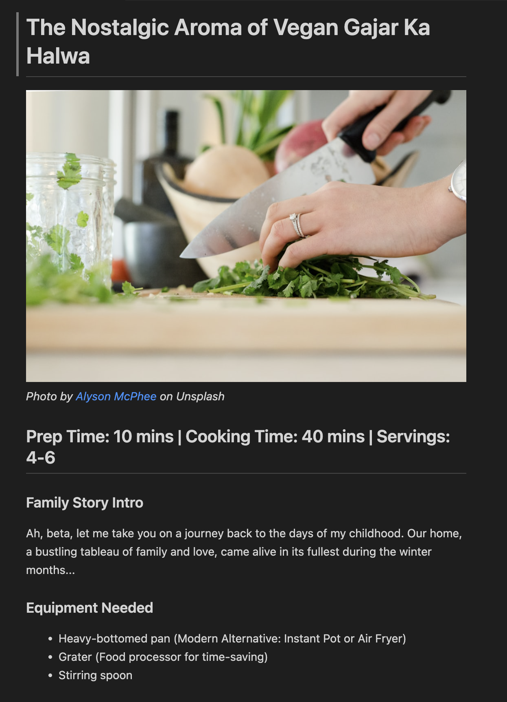

# **From Grannys Table**  
🍴 *Where Tradition Meets Modern Vegan Cooking*  

**From Grannys Table** is an AI-powered blog generator that brings the warmth and wisdom of an Indian grandmother's kitchen to life with modern vegan adaptations. Using **Crew AI**, this project creates engaging, intergenerational content written in the voice of a wise Indian Dadi (grandmother) and her tech-savvy granddaughter. Together, they transform traditional Indian recipes into vegan delights while preserving authentic flavors and cultural heritage. Perfect for food bloggers, recipe enthusiasts, or anyone looking to explore the fusion of traditional Indian cooking with modern vegan cuisine!  

---

## **Features**  
- 🥕 **Authentic Recipes**: Traditional Indian vegan dishes with a personal touch.  
- 🕰️ **Nostalgic Stories**: Heartwarming anecdotes from "Dadi's" kitchen.  
- 🌱 **Modern Hacks**: Time-saving tips and nutritional insights from the granddaughter.  
- 📸 **Image Integration**: Automatically sourced public domain images for visual appeal.  
- 🤖 **Flexible AI Backends**: Supports **OpenAI**, **Ollama**, and **DeepSeek-V3** for LLM-powered content generation.  

---
## **Sample**


---

## **Tech Stack**  
- **Crew AI**: Multi-agent framework for orchestrating the grandmother-granddaughter duo.  
- **LLM Backends**:  
  - **OpenAI GPT-3.5/4**: Default LLM for high-quality content generation.  
  - **Ollama**: Run local LLMs (e.g., LLaMA 2, Mistral) for privacy and customization.  
  - **DeepSeek-V3**: High-performance LLM for cost-effective and efficient content creation.  
- **Unsplash API**: For sourcing beautiful, royalty-free images.  
- **Markdown**: Easy-to-read and portable blog formatting.  

---

## **Getting Started**  

### **Prerequisites**  
1. Python 3.10 to 3.12  
2. Required API Keys:  
   - **OpenAI**: Get your key from [OpenAI Platform](https://platform.openai.com)
   - **Unsplash**: [Register for an API key](https://unsplash.com/developers)  
   - (Optional) **DeepSeek-V3**: [Sign up for access](https://www.deepseek.com/)  
3. (Optional) **Ollama**: [Install Ollama](https://ollama.ai/) and download a model (e.g., `ollama pull llama2`).  

## Installation

1. Clone the repository:
```bash
git clone https://github.com/yourusername/from-grannys-table.git
cd from-grannys-table
```

2. Install UV and dependencies:
```bash
pip install uv
crewai install
```

3. Create a `.env` file in the project root:
```env
OPENAI_API_KEY=your_openai_key_here
UNSPLASH_API_KEY=your_unsplash_key_here
MODEL_NAME=gpt-3.5-turbo  # or gpt-4, ollama/llama2, deepseek-v3
```

## Running the Project

1. With OpenAI (default):
```bash
crewai run
```

2. With Ollama:
```bash
# First ensure Ollama is running and model is downloaded
ollama pull llama2
# Update MODEL_NAME in .env to ollama/llama2
crewai run
```

3. With DeepSeek:
```bash
# Update MODEL_NAME in .env to deepseek-v3
crewai run
```

